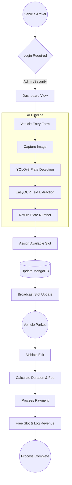
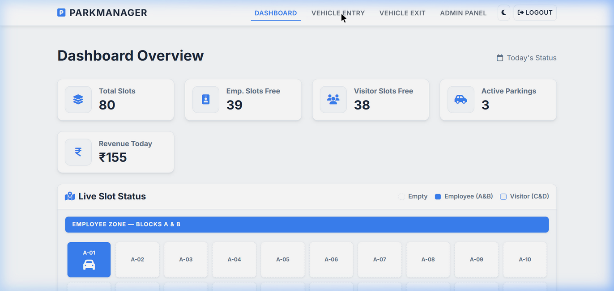
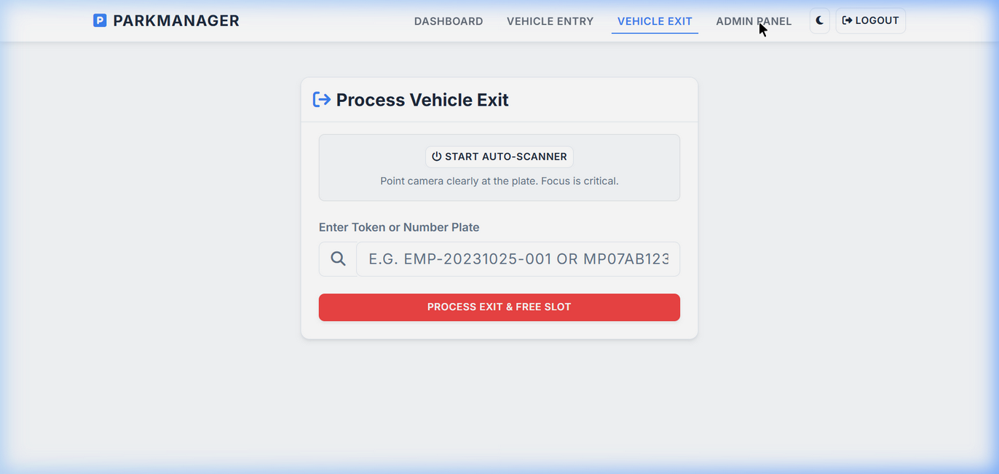

# 🅿️ ParkManager — Project Report

## 1. Introduction
**ParkManager** is a comprehensive, full-stack Parking Lot Management System designed to modernize urban parking infrastructure. The system provides a real-time interface for monitoring parking slot availability, managing vehicle entry/exit, and tracking revenue through an automated dashboard.

### Key Objectives:
- **Automation**: Minimize human error in slot assignment and fee calculation.
- **Real-time Tracking**: Provide instant visibility into parking occupancy using Socket.io.
- **AI Integration**: Utilize computer vision (YOLOv8) for automated license plate recognition (ALPR).
- **Security**: Implement role-based access control (RBAC) via JWT authentication.
- **Analytics**: Offer a data-driven revenue dashboard for administrators.

---

## 2. Methodology

### 2.1 Technology Stack
The project follows a decoupled architecture, separating the core management logic from the compute-intensive AI tasks.

| Component | Technology |
| :--- | :--- |
| **Frontend** | HTML5, CSS3 (Custom Styling), JavaScript (Vanilla), Socket.io-client |
| **Backend** | Node.js, Express.js, MongoDB (Mongoose), JWT, Socket.io |
| **AI Scanner** | Python 3.10, FastAPI, YOLOv8 (Ultralytics), EasyOCR |
| **Styling** | Bootstrap 5, Modern Glassmorphism UI |

### 2.2 System Architecture
The application is structured into three main layers:
1.  **Presentation Layer**: Web-based UI for Security and Admin roles.
2.  **Logic Layer**: Node.js server handling business rules, authentication, and database interactions.
3.  **Vision Layer**: Python microservice dedicated to processing camera frames and extracting plate information.

### 2.3 Workflow Flowchart
The following diagram illustrates the vehicle entry and exit lifecycle:



---

## 3. Source Code Highlights

### 3.1 Backend: Revenue Calculation Logic
The backend calculates fees dynamically based on duration and configurable rates.

```javascript
// From backend/routes/logs.js
router.post('/exit', auth, async (req, res) => {
    try {
        const { plateNumber } = req.body;
        const log = await Log.findOne({ plateNumber, status: 'Active' });
        
        if (!log) return res.status(404).json({ message: 'Vehicle not found' });

        const exitTime = new Date();
        const durationMs = exitTime - log.entryTime;
        const durationHours = Math.ceil(durationMs / (1000 * 60 * 60));
        
        const settings = await Settings.findOne();
        const totalFee = durationHours * settings.hourlyRate;

        log.exitTime = exitTime;
        log.fee = totalFee;
        log.status = 'Completed';
        await log.save();

        res.json({ log, message: 'Vehicle exit processed successfully' });
    } catch (err) {
        res.status(500).json({ error: err.message });
    }
});
```

### 3.2 AI Scanner: YOLOv8 Plate Detection
The Python microservice handles the high-performance detection and OCR.

```python
# From scanner/main.py
@app.post("/scan")
async def scan_plate(file: UploadFile = File(...)):
    image_bytes = await file.read()
    image = Image.open(io.BytesIO(image_bytes))
    
    # Detect license plate using YOLOv8
    results = model(image)
    
    plates = []
    for result in results:
        for box in result.boxes:
            # Crop and process each plate
            plate_crop = image.crop((box.xyxy[0].tolist()))
            text = reader.readtext(np.array(plate_crop))
            plates.append(text[0][1] if text else "Unknown")
            
    return {"plates": plates}
```

---

## 4. Results & Implementation

### 4.1 Dashboard Overview
The dashboard provides a real-time grid of parking slots. Green slots indicate availability, while occupied slots display vehicle details.



### 4.2 Revenue Analytics
Administrators can view daily and weekly revenue trends through dynamic charts.



### 4.3 Conclusion
The ParkManager system provides a robust and scalable solution for parking management. By integrating AI-driven scanning and real-time updates, it significantly enhances operational efficiency and data accuracy.

---
*Report generated on April 19, 2026*
